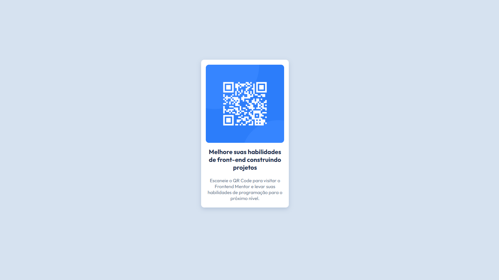

# QR Code Component | Desafio Frontend Mentor

Essa é a minha solução para o desafio [QR code component](https://www.frontendmentor.io/challenges/qr-code-component-iux_sIO_H) do Frontend Mentor. O objetivo era recriar um componente simples de cartão com QR Code, praticando HTML e CSS.

## 📷 Screenshot

## 🔗 Links

- **Solução no Frontend Mentor:** [Clique aqui]()
- **Site ao vivo:** [Clique aqui]()

## 🛠️ Tecnologias utilizadas

- HTML5 semântico
- CSS3
- Flexbox

## ✨ Aprendizados & Experimentos

Durante esse desafio, pratiquei:

- Centralizar elementos na tela usando **Flexbox** (`justify-content` + `align-items`).
- Diferença entre usar `margin: auto;` no container e centralizar direto no `body`.
- Responsividade simples com `max-width`.
- Organização do CSS e boas práticas de espaçamento.

## 🚀 Próximos passos

Quero continuar praticando:

- Flexbox para criar projetos mais complexos
- Responsividade avançada (layouts que se adaptam a várias telas)
- Uso de box-shadow para dar mais destaque a componentes

## 🙋‍♀️ Autora

### Gracielle Souza – Desenvolvedora Full Stack em formação, apaixonada por front-end, desafios e explorar novas possibilidades.

**Perfis:**

- 👩‍💻 Frontend Mentor – [@Glssv](https://www.frontendmentor.io/profile/Glssv)
- 🐙 GitHub – [@Glssv](github.com/Glssv)
- 💼 Linkedin - [Gracielle Souza](https://www.linkedin.com/in/gracielle-souza/)

---

  
  
Desenvolvido com 💜
 

